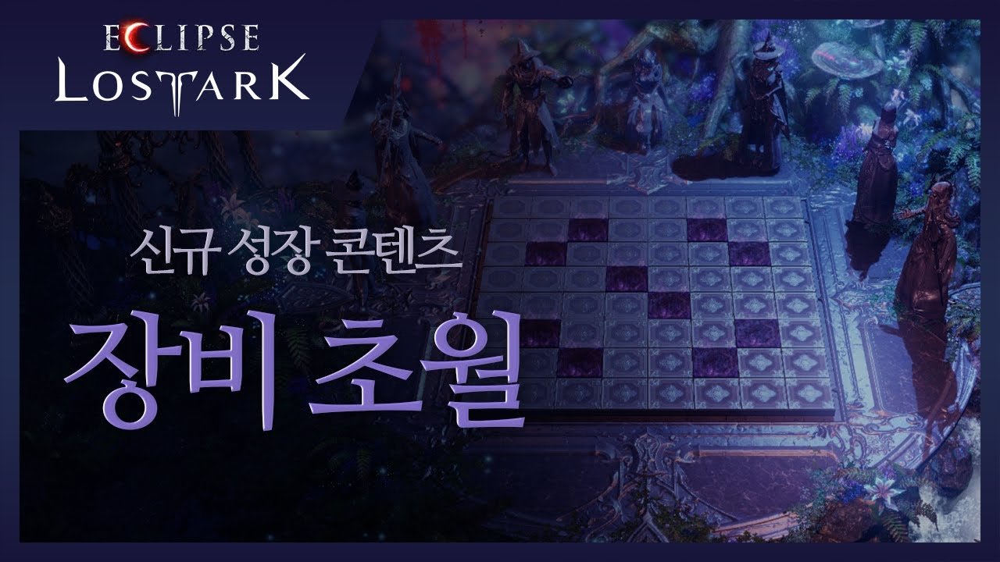

# 로스트아크 장비 초월 시뮬레이터

이미지 저작권 _ⓒ2023.Smilegate RPG.All rights reserved._
## 개요
로스트아크 장비 초월 시뮬레이터 (크롬 권장)  
링크: https://wkdtpgns5016.github.io/transcendence-simulator/  

로스트아크 공식 게임가이드를 참고하여 제작하였습니다.  
확률이 공개 안된 정령 효과는 임의로 확률을 설정하였습니다.  

로스트아크 공식 홈페이지 
[ https://m-lostark.game.onstove.com/GameGuide/Pages/%EC%B4%88%EC%9B%94 ]  

## 임의로 설정된 정령 효과 확률 및 알고리즘
### 벼락
> 벼락이 떨어지는 횟수를 균일한 확률로 설정, 석판 파괴 확률은 단계에 따라 확률 상승  
> 장판 재생성은 벼락 효과가 끝난 이후 재생성 됨  

&emsp;**[1단계]**  
&emsp;벼락 횟수: **0 ~ 2 랜덤** [빈 곳에 떨어질 경우 장판 재생성 (최대 1회)]  
&emsp;벼락 맞은 장판이 파괴될 확률 : **55%**  
&emsp;**[2단계]**  
&emsp;벼락 횟수: **0 ~ 4 랜덤** [빈 곳에 떨어질 경우 장판 재생성 (최대 1회)]  
&emsp;벼락 맞은 장판이 파괴될 확률 : **70%**  
&emsp;**[3단계]**  
&emsp;벼락 횟수: **0 ~ 6 랜덤** [빈 곳에 떨어질 경우 장판 재생성 (최대 1회)]  
&emsp;벼락 맞은 장판이 파괴될 확률 : **85%**  

&emsp;**벼락 알고리즘**  
&emsp;1. 벼락이 떨어질 횟수를 구한다.  
&emsp;2. 벼락을 맞을 석판을 랜덤으로 정한다.  
&emsp;3. 파괴 확률에 따라 석판을 파괴한다.  
&emsp;4. 2번에서 벼락이 빈 곳에서 떨어졌을 경우 장판을 랜덤하게 1개 재생성한다.  

### 신비
> 분출, 세계수의 공명 등장 확률을 균등하게 지정

&emsp;분출 등장 확률: **50%**  
&emsp;세계수의 공명 등장 확률: **50%**

## 업데이트 현황
> 2023-10-05: 초월 3단계 장판 추가  
> 2023-10-05: 장판 및 정령 효과 이미지 및 디자인 구성 중  
> 2023-10-05: ~~정령효과 정화 3단계 수정 필요~~ 수정완료  
